# GitHub Release Notification API

Monolith service on `Node.js + TypeScript` for GitHub release email
subscriptions.

## Tech stack

- Node.js
- Express
- TypeScript
- ESLint + Prettier
- Vitest
- Pino logger
- Docker + Docker Compose
- PostgreSQL (local in Docker, Neon for production)
- Redis (local in Docker, Upstash for production)

## Scripts

- `npm run dev` - run API in watch mode
- `npm run build` - compile TypeScript to `dist/`
- `npm run start` - run compiled app
- `npm run lint` - run ESLint
- `npm run lint:fix` - run ESLint with auto-fixes
- `npm run format` - run Prettier
- `npm run test` - run unit tests
- `npm run db:generate` - generate Drizzle migrations
- `npm run db:migrate` - apply migrations

## Clone project

```bash
git clone https://github.com/ViktorSvertoka/github-release-notification-api.git
cd github-release-notification-api
```

## Local run (without Docker)

```bash
cp .env.example .env
npm install
npm run dev
```

## Local run (Docker)

```bash
docker compose up --build
```

This starts:

- API on `http://localhost:3000`
- gRPC on `localhost:50051`
- PostgreSQL on `localhost:5432`
- Redis on `localhost:6379`

## Production deployment target

This project is prepared for:

- API container on Render
- PostgreSQL on Neon
- Redis on Upstash

`render.yaml` is included as a base Render blueprint.

## Deploy End-to-End (Render + Neon + Upstash)

### 1. Prepare managed services

- Create Neon project and database, copy connection string.
- Create Upstash Redis database, copy TCP connection string.
  - Use TCP URI format for this app: `rediss://default:<token>@<host>:6379`
- Prepare SMTP credentials (for example Mailtrap/SendGrid/Resend SMTP) to test
  confirmation/release emails in production.

### 2. Create Render Web Service

- Push repository to GitHub.
- In Render: `New` -> `Blueprint` -> select this repository.
- Render will read [render.yaml](./render.yaml) and create one Docker web
  service.

### 3. Set production environment variables in Render

Required:

- `NODE_ENV=production`
- `APP_BASE_URL=https://<your-render-service>.onrender.com`
- `DATABASE_URL=<Neon connection string with sslmode=require>`
- `REDIS_URL=<Upstash TCP rediss URL>`
- `SMTP_HOST=<smtp host>`
- `SMTP_PORT=587`
- `SMTP_USER=<smtp user>`
- `SMTP_PASS=<smtp password>`
- `SMTP_FROM=<verified sender>`

Recommended:

- `GITHUB_TOKEN=<github token>` (higher rate limit)
- `SCAN_INTERVAL_SECONDS=300`
- `CACHE_TTL_SECONDS=600`
- `API_KEY=<token>` (if you want protected `/api/*` endpoints)

### 4. Verify deployment

- Open `https://<your-render-service>.onrender.com/health` -> expect
  `{"status":"ok"}`.
- Open `https://<your-render-service>.onrender.com/metrics` -> expect Prometheus
  metrics output.

### 5. Verify real flow in production

1. Submit subscription from HTML page `GET /` or API:

```bash
curl -X POST "https://<your-render-service>.onrender.com/api/subscribe" \
  -H "Content-Type: application/json" \
  -d '{"email":"you@example.com","repository":"golang/go"}'
```

2. Open confirmation email from your SMTP inbox and click:
   `GET /confirm/{token}` (browser UX route).
3. Wait for scanner interval (or temporarily set `SCAN_INTERVAL_SECONDS=60` in
   Render for faster test).
4. Publish/check a repository with a new release tag and verify release email is
   delivered.
5. Click `GET /unsubscribe/{token}` and confirm notifications stop.

## Environment variables

See [.env.example](./.env.example) for the full list.

Core variables:

- `NODE_ENV`
- `PORT`
- `GRPC_PORT`
- `APP_BASE_URL`
- `GITHUB_TOKEN`
- `DATABASE_URL`
- `REDIS_URL`
- `CACHE_TTL_SECONDS`
- `SCAN_INTERVAL_SECONDS`
- `SMTP_HOST`
- `SMTP_PORT`
- `SMTP_USER`
- `SMTP_PASS`
- `SMTP_FROM`
- `API_KEY`

## Database and migrations

- PostgreSQL schema is defined in `src/db/schema.ts`
- SQL migrations are stored in `drizzle/`
- Migrations are executed automatically on service startup

## Redis cache

- GitHub repository existence checks are cached in Redis
- Default TTL is `600` seconds (`CACHE_TTL_SECONDS`)
- Cache key format: `gh:repo-exists:{owner}/{repo}`

## Scanner and notifier

- Release scanner runs every `SCAN_INTERVAL_SECONDS` (default `300`)
- Scanner checks latest release for tracked repositories with active
  subscriptions
- New tag detection logic:
  - if `last_seen_tag` is empty, scanner initializes it and does not send email
  - if latest tag differs from `last_seen_tag`, scanner sends email to active
    subscribers and updates `last_seen_tag`
- SMTP notifier is enabled only when all required SMTP variables are provided
- `POST /api/subscribe` sends a confirmation email with links to:
  - `GET /confirm/{token}` (UX page)
  - `GET /unsubscribe/{token}` (UX page)

## REST contract vs UX routes

- Contract endpoints (OpenAPI, machine/API usage):
  - `POST /api/subscribe`
  - `GET /api/confirm/{token}`
  - `GET /api/unsubscribe/{token}`
  - `GET /api/subscriptions?email={email}`
- Browser UX wrappers:
  - `GET /confirm/{token}` -> renders styled confirmation result page
  - `GET /unsubscribe/{token}` -> renders styled unsubscribe result page
- UX routes call the same business logic as `/api/*`; they are additive and do
  not change Swagger contracts.

## API key auth (optional)

- Set `API_KEY` to enable API key protection for `/api/*`
- Send token via `x-api-key` request header
- Public exceptions (no API key required):
  - `GET /api/confirm/{token}`
  - `GET /api/unsubscribe/{token}`
- Note: browser UX routes `/confirm/{token}` and `/unsubscribe/{token}` are
  outside `/api/*` and remain public.

## Prometheus metrics

- `GET /metrics` exposes Prometheus metrics
- Includes:
  - HTTP requests count (`app_http_requests_total`)
  - HTTP request duration (`app_http_request_duration_seconds`)
  - Scanner runs (`app_scanner_runs_total`)
  - Email notifications (`app_email_notifications_total`)
  - GitHub rate-limit errors (`app_github_rate_limit_errors_total`)

## API contract

OpenAPI contract is available in [swagger.yaml](./swagger.yaml).

## gRPC interface (optional extra)

- Proto file:
  [proto/release_notification.proto](./proto/release_notification.proto)
- gRPC server runs in the same monolith process as REST API.
- Default port: `50051` (`GRPC_PORT` env var).
- Implemented RPC methods:
  - `Subscribe`
  - `Confirm`
  - `Unsubscribe`
  - `ListSubscriptions`

Quick local check with `grpcurl`:

```bash
grpcurl -plaintext \
  -d '{"email":"you@example.com","repository":"golang/go"}' \
  localhost:50051 release_notification.v1.SubscriptionService/Subscribe
```

## Subscription page

- `GET /` serves a responsive HTML subscription page
- the page submits to `POST /api/subscribe`

Healthcheck endpoint:

`GET /health`

## Main Features

### 1) Home page

- Responsive landing page for release subscriptions
- Clean UX flow with inline validation and status messages
- Connected to `POST /api/subscribe`

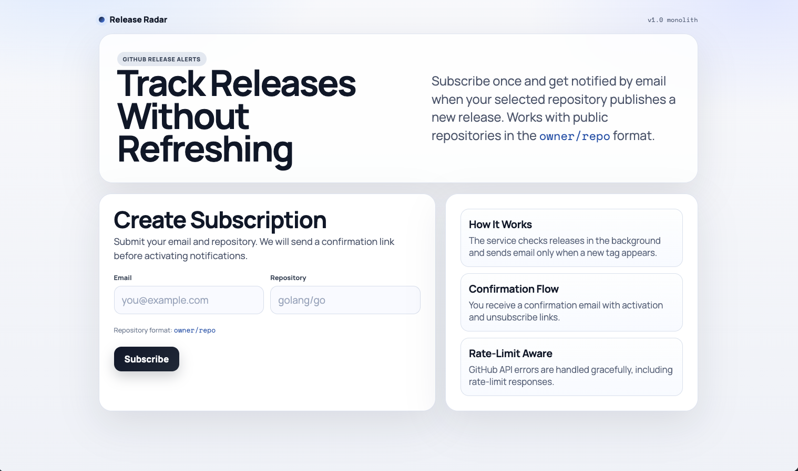

### 2) Confirmation email

- HTML email template with clear CTA buttons
- Includes both confirmation and unsubscribe links
- Sent via SMTP provider (Mailtrap Transactional / production SMTP)

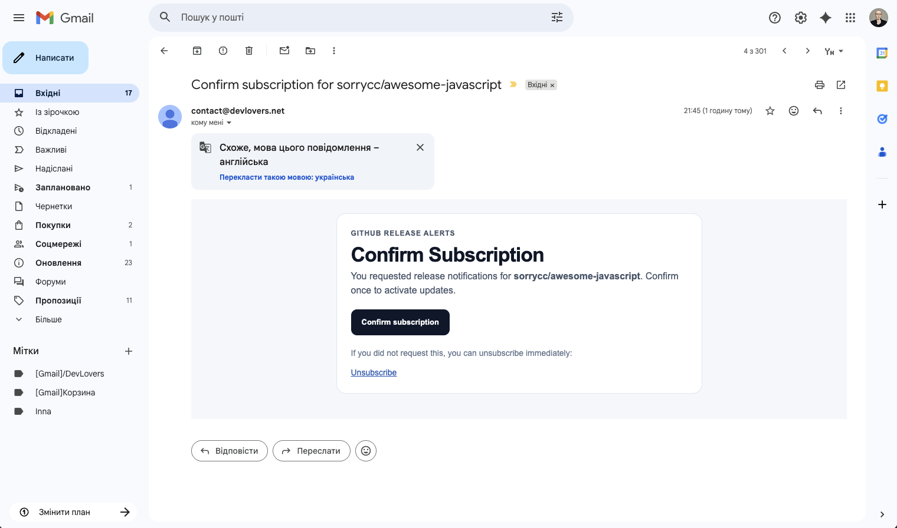

### 3) Confirm subscription flow

- Browser-friendly confirmation page (`/confirm/:token`)
- Activates subscription status in database
- Styled success/error UI for non-technical users

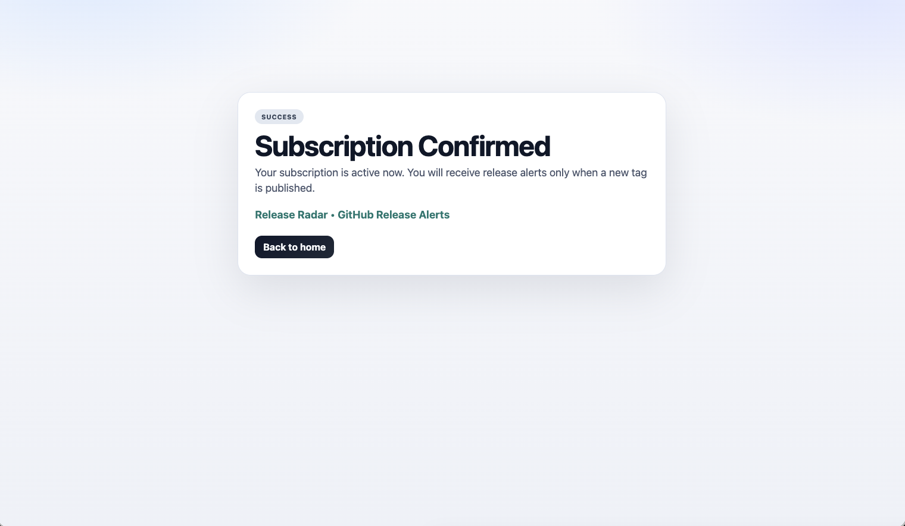

### 4) Unsubscribe flow

- Browser-friendly unsubscribe page (`/unsubscribe/:token`)
- Safely deactivates subscription
- Styled success/error UX

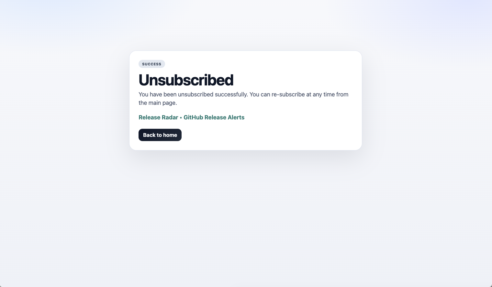

### 5) New release notification email

- Styled HTML email for newly detected repository releases
- Contains release metadata (repository + tag)
- Includes direct `View release` CTA link

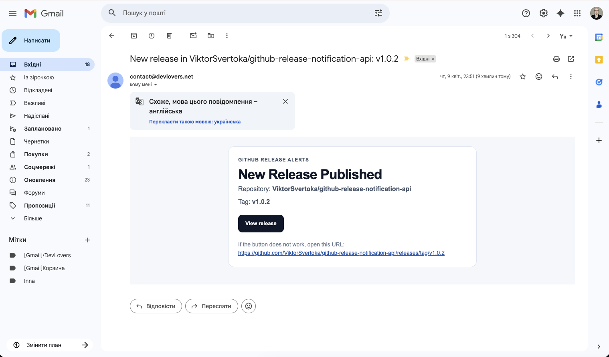

### 6) Production deployment (Render)

- Monolith deployed and running on Render
- Healthcheck and API endpoints available publicly
- Runtime environment configured via environment variables

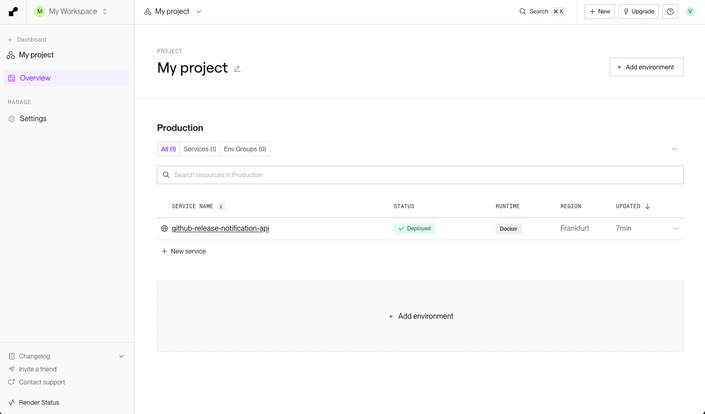

### 7) PostgreSQL database (Neon)

- Persistent storage for repositories/subscriptions/deliveries
- Drizzle migrations executed on startup
- Production data hosted on Neon

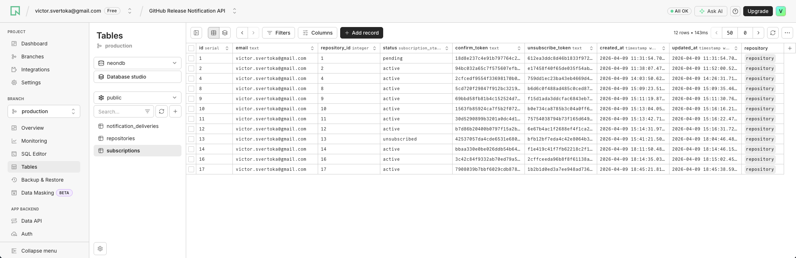

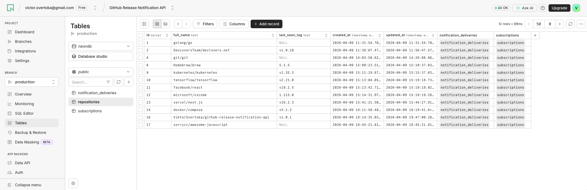

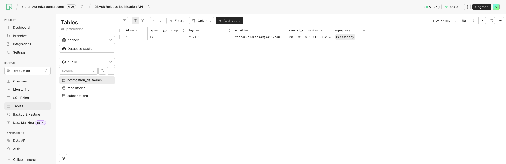

### 8) Redis cache (Upstash Redis)

- GitHub API response caching with TTL = 10 minutes
- Reduces external API calls and improves stability
- Used for repository existence and release lookup optimization

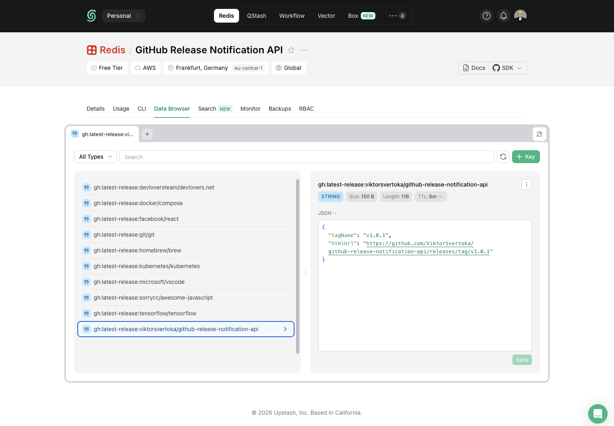

### 9) Prometheus metrics

- `/metrics` endpoint exposed for observability
- Includes HTTP, scanner, email, and GitHub rate-limit metrics
- Ready for Prometheus scraping and dashboarding

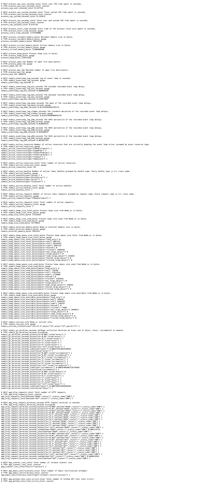

### 10) CI pipeline (GitHub Actions)

- Automated lint and unit tests on every push and pull request
- Prevents regressions before merge
- Enforces baseline code quality checks

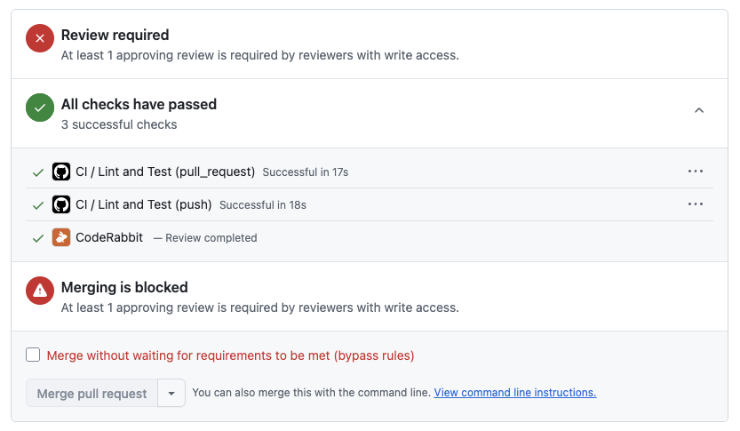
